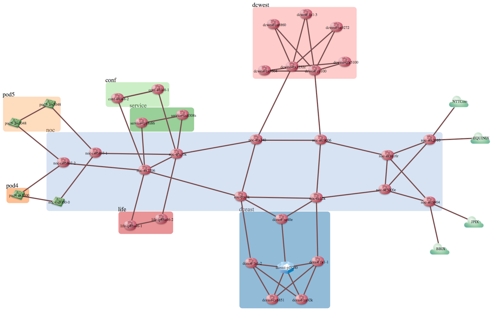

# inet-henge.js

Generate d3.js based Network Diagram from JSON data.

## Getting Started

To be updated

* Requirements: [cola.js](http://marvl.infotech.monash.edu/webcola/)

### Usage

In example [here](example/shownet.html), load related assets first:

* d3.js
* cola.js
* inet-henge.js

```html
<!DOCTYPE html>
<html>
  <head>
    <meta charset="utf-8" />
    <link href="style.css" rel="stylesheet" />
    <script src="https://cdnjs.cloudflare.com/ajax/libs/d3/3.5.17/d3.js"></script>
    <script src="../vendor/cola.3.1.3.min.js"></script>
    <script src="../index.js"></script>
  </head>
```

define a blank container:


```html
  <body>
    <div id="diagram"></div>
  </body>
```

and render your network diagram:

```html
  <script>
   new Diagram('#diagram', 'shownet.json').init('interface');
  </script>
</html>
```

inet-henge.js renders your network diagram as SVG within ```<div id="diagram"></div>```. The diagram also displays metadata labelled ```'loopback'``` and ```'interface'``` which defined in JSON data.




#### JSON Data

Minimal json looks like:

```json
{
  "nodes": [
    { "name": "A" },
    { "name": "B" }
  ],

  "links": [
    { "source": "A", "target": "B" }
  ]
}
```

You can specify icon for each node:

```json
{
  "nodes": [
    { "name": "dceast-ne40e", "url": "./images/router.png" },
```

Or metadata to display on network diagrams.

```json
    { "name": "dceast-fx1-1", "meta": { "loopback": "10.0.0.1" } },
    ...
  ],
  "links": [
    { "source": "noc-asr9904", "target": "noc-ax8616r",
      "meta": { "interface": { "source": "0-0-0-2", "target": "1-1" } }
```

metadata for links should be described in the format:

```json
"name": { "source": "data for source", "target": "data for target" }
```

## Contributing

Please report issues or enhancement requests to [GitHub issues](https://github.com/codeout/inet-henge/issues).
For questions or feedbacks write to my twitter @codeout.

Or send a pull request to fix.


## Copyright and License

Copyright (c) 2016 Shintaro Kojima. Code released under the [MIT license](LICENSE).
